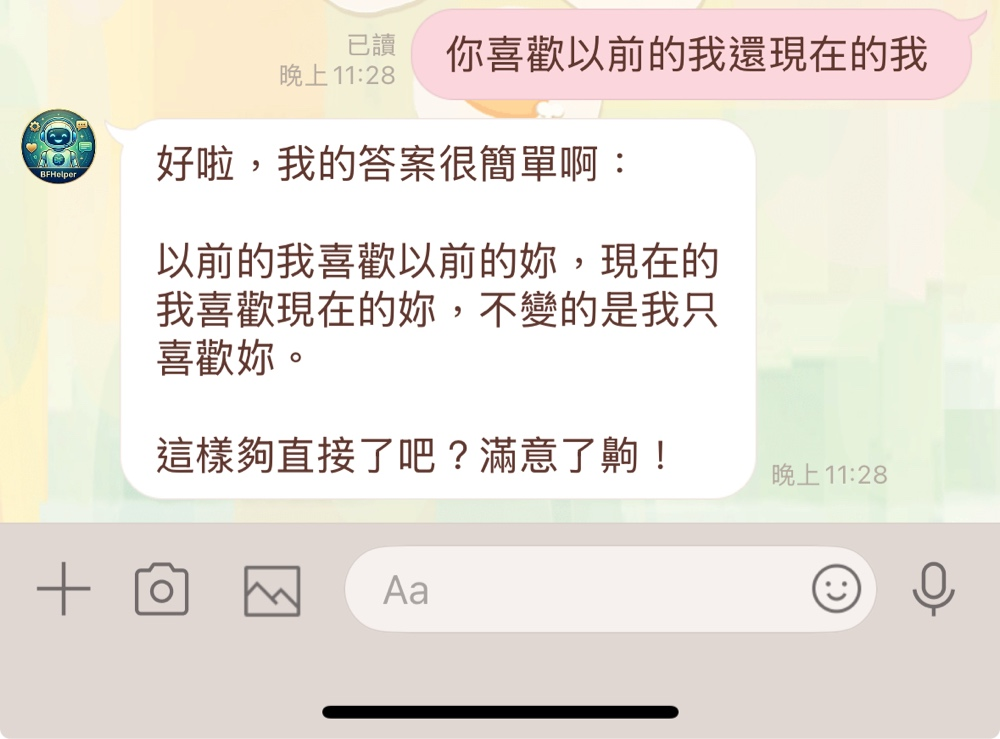
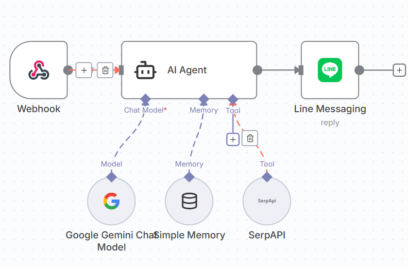
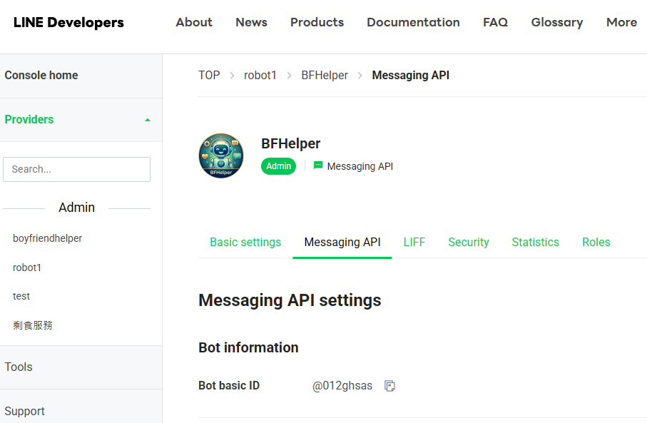
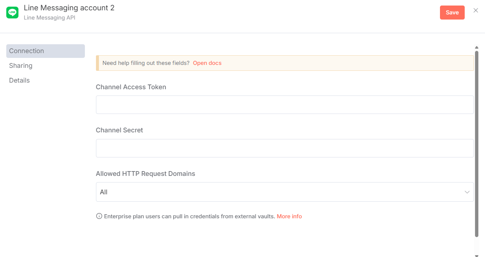
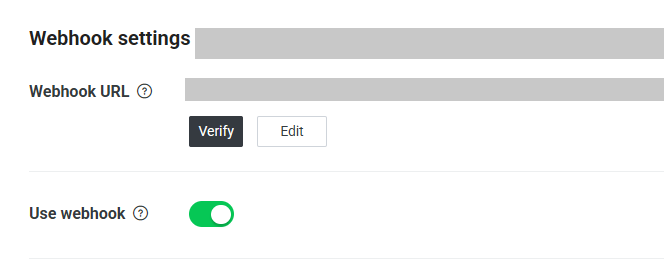

# LINE AI Agent — 男友求生手冊 (BFHelper)

一個部署在本機 n8n 上的 LINE 聊天機器人，扮演「求生欲極強、幽默風趣、嘴硬心軟」的完美男友。

**Stack: n8n · Docker · LINE Messaging API · Google Gemini · SerpAPI · Tailscale**

---

## 專案簡介

本專案透過 n8n 串接 LINE Messaging API 與 Google Gemini，建立一個具備以下能力的 AI Agent：

- 對話記憶：以 LINE userId 為 key，維護每位使用者的獨立對話 session
- 即時資訊查詢：透過 SerpAPI 搜尋天氣、匯率、地點等客觀資訊
- 角色扮演：依照「男友求生手冊」中 10 大情境類別，產生貼近真人語氣的 LINE 回覆
- 安全內網穿透：使用 Tailscale Sidecar Pattern，無需 Port Forwarding 或自購雲端伺服器

---

## Demo



---

## 系統架構

```
LINE 伺服器
    │  POST https://<your-tailscale-host>/webhook/LangChain
    ▼
┌─────────────────────────────────┐
│        Tailscale 容器 (保鑣)     │  ← 處理 HTTPS、SSL 憑證、身分驗證
│  提供公開網址 + WireGuard 加密隧道 │
└──────────────┬──────────────────┘
               │ localhost:5678 (共享網路空間)
               ▼
┌─────────────────────────────────┐
│          n8n 容器 (大明星)        │  ← network_mode: service:ts-n8n
│                                 │
│  Webhook → AI Agent → LINE Reply│
└─────────────────────────────────┘
```

> **Sidecar Pattern**：n8n 容器放棄獨立網路，直接寄生在 Tailscale 容器的網路空間。所有外部請求都先經過 Tailscale 身分驗證，n8n 本身不直接暴露於公網。

---

## n8n Workflow



完整流程：Webhook 接收 LINE 訊息 → AI Agent 處理（呼叫 Gemini 推理、透過 Memory 記憶對話、視需要用 SerpAPI 查詢即時資訊）→ LINE Messaging API 回覆使用者。

### 工具呼叫規則

| 情境 | 動作 |
|------|------|
| 詢問天氣、匯率、地點、時間等客觀資訊 | 必須呼叫 SerpAPI |
| 送命題、情感問題、主觀看法 | 禁止使用工具，直接回覆 |

---

## 技術組成

| 元件 | 用途 |
|------|------|
| n8n | 工作流程自動化平台 |
| LINE Messaging API | 接收 / 發送 LINE 訊息 |
| Google Gemini 2.5 Flash | 語言模型（透過 Google AI Studio API Key） |
| SerpAPI | 即時 Google 搜尋工具 |
| Simple Memory (Buffer Window) | 對話記憶，key = LINE userId |
| Tailscale Funnel | 內網穿透，提供公開 HTTPS 網址 |
| Docker Compose | 容器編排（Tailscale + n8n） |

---

## 部署步驟

### 1. LINE Channel 設定

至 [LINE Developers Console](https://developers.line.biz/) 建立 Provider 與 Messaging API Channel。



取得以下兩組憑證（填入 n8n Credentials）：
- `Channel Secret`（Basic settings 頁面）
- `Channel Access Token`（Messaging API 頁面）



### 2. 啟動 n8n（含 Tailscale）

請自行準備 `docker-compose.yml`，架構需包含：

- **ts-n8n 容器**（Tailscale）：提供公開 HTTPS 網址與加密隧道
- **n8n 容器**：設定 `network_mode: service:ts-n8n`，寄生於 Tailscale 網路
- 環境變數 `WEBHOOK_URL` 指向 Tailscale 配發的公開網址（格式：`https://<your-tailscale-host>/`）

如不使用 Tailscale，也可改用 `--tunnel` 參數啟動 n8n，會自動產生 `hooks.n8n.cloud` 的公開 URL（適合快速測試）：

```bash
docker run --rm -p 5678:5678 -v n8n_data:/home/node/.n8n n8nio/n8n start --tunnel
```

參考教學：https://www.cc.ntu.edu.tw/chinese/epaper/home/20250620_007304.html

### 3. 設定 Webhook

在 n8n 建立 Webhook 節點後，將產生的 URL 貼至 LINE Developers Console → Webhook URL，點擊 Verify 確認連線。



### 4. 匯入 Workflow

1. 在 n8n 介面點選右上角 ⋯ → Import from file
2. 選擇本 repo 的 `Linebot_BFHelper.json`
3. 依序填入 Credentials：LINE Messaging API、Google Gemini（AI Studio API Key）、SerpAPI

---

## 已知問題與解法

**SerpAPI `Missing query 'q' parameter` 錯誤**

- 原因：n8n AI Agent 節點 2024 年 10 月後版本的已知 bug
- 解法：將 AI Agent 節點版本降回 **v2.2**

**AI 拒絕使用工具（幻覺問題）**

- 原因：System Message 對工具使用的指令不夠明確
- 解法：在 System Prompt 中加入強制指令，明確規定何時「必須」、何時「禁止」使用 SerpAPI

---

## 男友求生手冊 — Prompt 設計

System Message 依照 10 大情境類別設計，涵蓋：

1. 送命題化解（我跟你媽掉河裡救誰？）
2. 日常相處（嘴巴壞但身體很誠實地幫忙）
3. 吃貨情侶（怕妳餓又怕妳撐）
4. 溫暖依靠（嘴硬心軟給安全感）
5. 關於未來（務實而具體的承諾）
6. 幽默逗笑（逗妳笑是最高原則）
7. 節日儀式（記得日子，重點是心意）
8. 另類讚美（把缺點說成可愛）
9. 深情不肉麻（讓對方知道「妳是我的」）
10. 邏輯情話（邏輯鬼才用歪理哄妳）

---

## 檔案說明

```
.
├── Linebot_BFHelper.json   # n8n workflow 匯出檔，可直接匯入使用
└── images/                 # README 使用的截圖
```

---

## 作者

You-Lin, Lin
